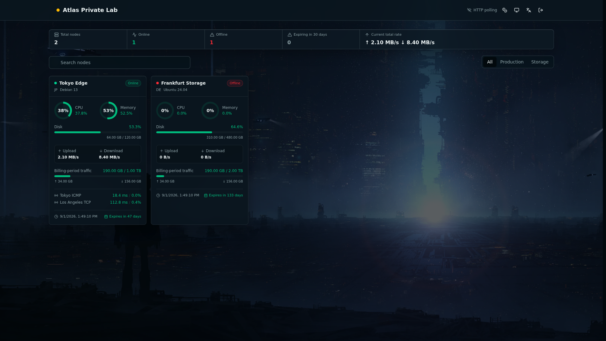

# Komari Atlas

A monitoring console theme for personal, self-hosted [Komari Monitor](https://github.com/komari-monitor/komari) instances.

[简体中文](README.md) · [Download the latest release](https://github.com/qqqasdwx/komari-atlas/releases/latest/download/komari-atlas.zip)



Komari Atlas brings node status, metric history, network quality, billing traffic, and asset information into one dashboard for private Komari instances that require authentication.

## Core Features

- **Node overview**: View all node states in one place, with search, grouping, and sorting by resources, network activity, cost, or expiry.
- **Resource monitoring**: Track CPU, system load, memory, swap, disk, network rates, processes, and connections, with GPU metrics when available.
- **History analysis**: Explore resource trends over `1h`, `6h`, `24h`, `7d`, or `30d` and identify offline periods.
- **Latency monitoring**: Review 24-hour latency and packet-loss history for each monitoring route, then choose dashboard routes, ordering, and severity thresholds.
- **Traffic accounting**: Track billing-period usage, traffic limits, daily upload and download totals, and monthly reset dates.
- **Cost and assets**: Summarize monthly cost, expiry, and current remaining value, with long-term nodes, currency conversion, and per-node valuation.
- **Everyday use**: Includes screenshot privacy mode, Simplified Chinese and English, light and dark appearances, and desktop and mobile layouts.

## Installation

### Install from the Theme Market (recommended)

1. Open **Theme Market** in the Komari admin dashboard and select **Manage sources**.
2. Add a source named `Komari Atlas` with this URL:

   ```text
   https://raw.githubusercontent.com/qqqasdwx/komari-atlas/main/v1.json
   ```

3. Return to the Theme Market, find **Komari Atlas**, install it, and set it as the active theme.

Once the source is added, later releases can be checked and installed from the Theme Market.

### Manual installation

1. Download [`komari-atlas.zip`](https://github.com/qqqasdwx/komari-atlas/releases/latest/download/komari-atlas.zip).
2. Upload the theme archive in the Komari admin dashboard.
3. Set **Komari Atlas** as the active theme.

## Requirements

- Komari `1.4.3` or newer
- A private Komari instance that requires authentication
- Metric recording enabled; a complete monthly billing-traffic calculation requires at least 35 days of retained metrics

Billing periods use the `Asia/Shanghai` timezone. A node's configured traffic reset day takes priority over its expiry day; days 29 through 31 use the last day of shorter months.

## Configuration

Each node can configure its traffic reset day, dashboard latency routes, route order, and latency and packet-loss thresholds from the detail view. These settings are stored in Komari `theme_settings`.

Interface language, appearance, and asset-summary currency are stored in the current browser. Privacy mode applies only to the current page session.

## Local Development

Use Node.js 22 or newer and install the locked dependencies:

```bash
npm ci
cp .env.example .env.local
npm run dev
```

`NEXT_PUBLIC_API_TARGET` defaults to `http://127.0.0.1:25774`. When the frontend runs at `http://localhost:3000`, add that exact origin to both `cors_allowed_origins` and `ws_allowed_origins` in Komari.

## Build and Validation

```bash
npm run lint
npm run typecheck
npm test
npm run build
```

`npm run build` exports the static site to `dist/`. Run `./build-theme.sh` to install dependencies, build the project, and create `dist/komari-atlas-YY.MM.DD-COMMIT.zip`; the script also requires `zip`.

## Credits and License

Komari Atlas began from [tonyliuzj/komari-next](https://github.com/tonyliuzj/komari-next). Thanks also to [piphase/komari-nexus](https://github.com/piphase/komari-nexus) and [fanchengliu/komari-next-pro](https://github.com/fanchengliu/komari-next-pro) for their work in the Komari theme ecosystem.

Released under the [MIT License](LICENSE). Original copyright notices are retained.
